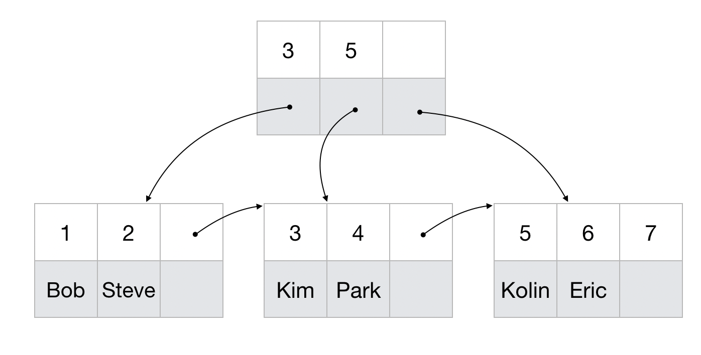
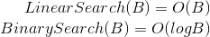
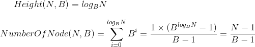
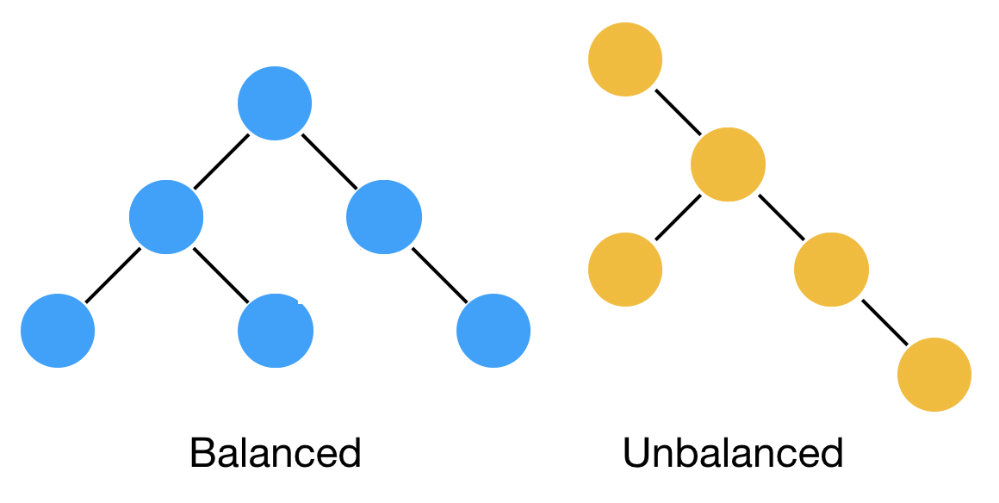
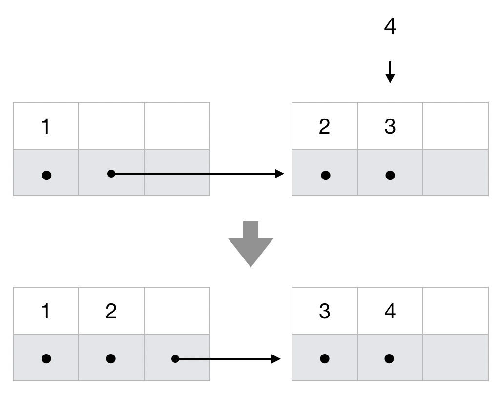
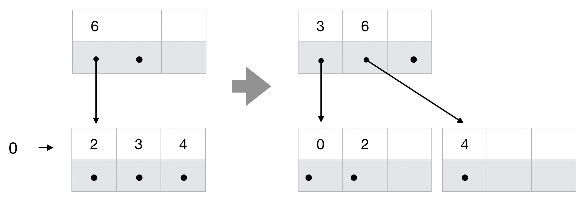

# On-Disk B+ Tree

Database 내부 Record Mangement system을 위한 On-disk B+ Tree 소개 및 In-Memory 구현체 분석.

## 1. What is B+ Tree

Tree형 자료구조의 일종으로 정렬된 Key-Value Pair에 대한 효율적인 삽입, 검색, 삭제를 지원한다.



각각의 노드는 최대 노드 갯수 B를 기준으로 루트 노드를 제외, {B - 1}개의 키와 B개의 자식 노드를 가질 수 있다. Pair의 수에 따라 다계층으로 구성되며, 계층의 수와 검색에 소요되는 시간이 비례한다. 이에 계층 수를 tight하게 관리하기 위해 추가적인 Balancing policy를 보유하고 있다. 이는 기존의 B-Tree와도 유사하며, B+Tree는 sibling에 대한 포인터를 가져 다음 Key-Value Pair로의 Sequential한 검색이 가능하단 장점을 가진다. 

## 2. Why it used as on-disk data structure

B+ Tree는 B라는 Branching Factor를 Hyperparameter로 가지고 있는데, 이 크기가 늘어날 수록 하나의 노드에서 키를 찾는데 시간이 상대적으로 증가하지만, 디스크 접근 속도가 월등히 느린 현대 컴퓨터에서는 B를 키워 노드를 읽는 수를 줄일 수 있다는 장점을 가진다.

하나의 노드 내에서 키를 검색하는데에는 선형 탐색을 가정할 때 B번, 2진 탐색을 가정할 때 logB의 시간 복잡도를 가진다.



N개의 데이터를 가정할 때, 자료 구조에서 요구하는 노드의 수와 트리의 높이는 다음과 같다.



기존의 BST나 AVL 트리가 B=2를 기준으로 했다면, B+ Tree (혹 B Tree)는 이를 보다 일반화 하여 노드를 불러오는 횟수를 줄인 자료구조이다. 디스크에서 노드를 불러온 후, 키를 검색하는 알고리즘은 In-Memory로 작동하기 때문에 기존의 트리형 자료구조에 비해 빠른 검색을 지원한다.

## 3. Balancing policy

B+ Tree에는 몇가지 Constraint가 존재한다.
- 최대 자식 노드 수 : B
- 최소 자식 노드 수 (root 제외) : ceil(B / 2)
- 최대 key 수 : B - 1
- 최소 key 수 (root 제외) : ceil(B / 2) - 1

이는 노드가 가지는 키의 수가 불균형할 수 있어 생기는 문제를 해결하기 위함이다. 위의 조건을 만족하기 위해 B+ Tree (혹은 B-Tree)는 Tree Balancing Policy를 가진다. 

1. Redistribute

일반 Tree의 경우 새로운 Key-Value Pair가 특정 Leaf node에만 추가되거나, 특정 노드에서만 Deletion이 발생할 경우 Tree Unbalancing 문제가 발생할 수 있다.



B+ Tree는 이에 노드가 최대 최소 조건을 어겼을 때, Sibling 노드를 조사하여 자신의 Pair를 Sibling에게 전달하거나 받아온다. 



좌측 노드에 키와 포인터를 넘겨 주거나(insertion), 받을(deletion) 여력이 있다면 가장 작은 키를 좌측 노드에 추가하거나, 좌측 노드의 가장 큰 키를 받아온다. 같은 논리로 우측 노드에 자리가 있다면, 가장 큰 키를 우측 노드로 전달하거나, 우측 노드의 가장 작은 키를 가져온다. 이를 Key Rotation 혹은 Redistribution이라 표현한다.

2. Split

Insertion 과정에서 더 이상 Redistribution을 할 수 없는 경우, 혹 특정 level이 수용할 수 있는 최대 key의 수를 넘어설 경우 B+Tree는 하나의 노드를 두개의 노드로 분리, Split 한다. 



요청 받은 키를 추가하고 (B+1개 키), 중간값을 기준으로 두개의 독단적인 노드로 분리한다 (left node B/2개 키 + key + right node B/2개 키). 이후 중간 key를 상위 노드에 insert 하며, 삽입된 키의 좌우로 분리된 두개의 노드를 하위 노드로 연결한다. 

3. Merge

Remove 과정에서 더 이상 Redistribution을 할 수 없는 경우, 혹 특정 level이 수용해야 하는 최소 key의 수를 넘어설 경우 B+Tree는 두개의 노드를 하나의 노드로 합친다 (Merge).


두개 노드를 연결하고 있는 상위 노드의 키를 가져와 left node + key + right node의 꼴로 연결한다. 이 후 상위 노드에서 해당 키를 Delete한다. 

## 4. Analyze bpt.c

[bpt.c](./src/bpt.c)은 B+Tree의 In-Memory 구현체이다. 실제 구현체를 통해 insertion, deletion, merge, split, redistribution operation을 분석한다.

### 1. Insertion method in bpt.c

[bpt.c](./src/bpt.c)에서는 insertion을 총 4가지 경우로 나눈다.

1. 이미 주어진 key가 주어진 경우
```c
if (find(root, key, false) != NULL)
    return root;
```
key가 이미 tree에 존재하는 경우 추가 수정을 하지 않는다.

2. tree가 비어 있는 경우
```c
if (root == NULL) 
    return start_new_tree(key, pointer);
```
새로운 tree를 생성하여 반환한다.

3. key number constraint를 어기지 않는 경우
```c
```
4. 어기는 경우

위 구현체에서는 insertion 과정에 redistribution policy를 적용하지 않고 split만을 진행한다. 

### 2. Deletion method in bpt.c

### 3. Merge operations in bpt.c

### 4. Split operation in bpt.c

## 5. Naive Design requirements for on-disk b+ tree
